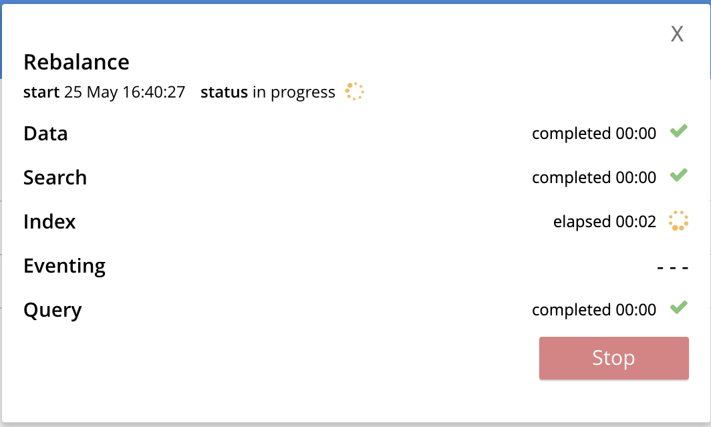

# Deploying Multiple Couchbase Server Containers on One Physical Machine

Run the following commands in terminal

```bash
docker run -d --name db1 couchbase
docker run -d --name db2 couchbase
docker run -d --name db3 -p 8091-8094:8091-8094 -p 11210:11210 couchbase
```

Check the Docker logs to verify that the containers have started:

```bash
docker logs db1
docker logs db2
docker logs db3
```

If the containers have started, all the above commands should return the following output:

```bash
Starting Couchbase Server -- Web UI available at http://<ip>:8091
```

###### Note: If Couchbase Server is running locally on the machine without containers, the port mappings above under the -p option may fail. Ensure that you stop your local instance of Couchbase Server before running the above command

Run docker inspect to discover the local IP addresses for each container. You will need the IP addresses for db1 and db2 to set up the 3 node Couchbase Server cluster. The initial cluster setup will automatically pick up the IP address for db3.

```bash
docker inspect --format '{{ .NetworkSettings.IPAddress }}' db1
docker inspect --format '{{ .NetworkSettings.IPAddress }}' db2
```

From the browser, access the Web Console using http://localhost:8091. You are now connected to container named db3. If the container is up and running, you will see the Couchbase Server Setup Screen.


Walk through the Setup wizard and accept the default values, you may switch off the Analytics Service if you're facing shortage of RAM

Next, we need to add the db1 and db2 containers to the cluster.

On the Web Console, go to the Server Nodes tab and click Add Server and specify the IP address you captured for db1.


Click Add Server again and specify the IP address you captured for db2

Click Rebalance.



This is all that is needed for a multi-node Couchbase Server cluster deployment using a single physical machine.

## Setting up data

Create a bucket in the couchbase with name `cachestore` by navigating to buckets menu and then clicking on `ADD BUCKET` located at the top of the screen.
Now go to the `query` menu and run the following query

```sql
INSERT INTO `cachestore` (KEY, VALUE) VALUES ("key1", "somevalue1")
```
